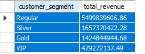
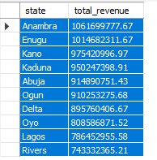

# NaijaMart E-Commerce Sales & Customer Analytics Using SQL

## Project Overview

This project analyzes customer behavior, revenue performance, product trends, payment preferences, and delivery operations for NaijaMart, a fictional Nigerian e-commerce company.

The objective was to use SQL to uncover actionable business insights that support data-driven decision-making and business growth.

---

## Business Problem

NaijaMart needed visibility into:

* Customer purchasing behavior
* Revenue drivers
* Product performance
* Regional sales trends
* Payment preferences
* Delivery performance

Management required data-driven insights to improve customer retention, operational efficiency, and profitability.

---

## Tools Used

* MySQL
* SQL
* MySQL Workbench

---

## Database Structure

The project consists of seven relational tables:

* Customers
* Sellers
* Products
* Orders
* Order Details
* Deliveries
* Customer Reviews

---

## SQL Skills Demonstrated

* JOINs
* Aggregations
* GROUP BY
* ORDER BY
* Window Functions
* Revenue Analysis
* Customer Segmentation
* Business Performance Analysis

---

## Key Insights
## Sample Analysis

### Revenue by Customer Segment

The analysis revealed that Regular customers generated the highest revenue, contributing approximately ₦5.5 billion in sales.

### Revenue by State

State-level analysis showed that Anambra generated the highest revenue at approximately ₦1.06 billion, followed by Enugu and Kano.

* Regular customers generated approximately ₦5.5 billion in revenue.
* Anambra generated the highest state revenue at ₦1.06 billion.
* Computing was the highest-performing category with ₦1.7 billion in revenue.
* USSD was the most frequently used payment method.
* Average delivery time was 7.47 days.
* Average product rating was 3.07/5.

---

## Business Recommendations

* Strengthen customer retention initiatives.
* Expand computing product offerings.
* Improve logistics and delivery performance.
* Increase investment in high-performing regions.
* Enhance customer experience through better packaging and service quality.

---

## Project Structure

SQL_Scripts

Screenshots

Case_Study

README.md

---

## Author

**Nwosu Onyinyechi**

Data Analyst | Business Intelligence Analyst

LinkedIn: [www.linkedin.com/in/onyinyechi-janet-nwosu](http://www.linkedin.com/in/onyinyechi-janet-nwosu)

Portfolio: https://nwosu-onyinye.github.io/
